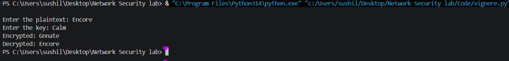

# Experiment 1: Implement and Analyze Classical Symmetric Ciphers

## Objective

To implement and analyze classical symmetric ciphers (Caesar and Vigenère) for encryption and decryption.

## Procedure

### Caesar Cipher

1. Open Python 3 in VS Code and run the Caesar cipher program. Provide the plaintext and required shift value as input.

   [View Caesar Cipher Code](Code/Caesar_cipher.py)

2. Encrypt the plaintext using a fixed shift with modulo 26, while preserving spaces and punctuation. Decrypt the ciphertext using the reverse shift and compare it with the original plaintext.
   
   

### Vigenère Cipher

3. Run the Vigenère cipher program and provide the plaintext and alphabetic key as input.

   [View Vigenère Cipher Code](Code/Vignere_cipher.py)

4. Encrypt the plaintext using the repeating key, preserving spaces and punctuation without advancing the key. Decrypt the ciphertext using the same key and compare it with the original plaintext.

   

5. Run test cases for both ciphers and verify the decrypted messages.

## Result

The Caesar and Vigenère cipher programs successfully performed encryption and decryption. All 4 test cases produced correct round-trip results, giving a 100% verification success rate.

## Discussion

Both ciphers successfully performed encryption and decryption, with the decrypted messages matching the original plaintexts in all test cases.

The Caesar cipher uses one fixed shift, making it simple but vulnerable to brute-force and frequency analysis. Vigenère uses a repeating key with different shifts, reducing simple letter patterns, but it can still be attacked when enough ciphertext is available.

## Improvements

- **Caesar Cipher:** Modified the program to accept plaintext and shift value from the user instead of using fixed values.
- **Vigenère Cipher:** Modified the program to accept plaintext and key from the user, making it interactive.

## Conclusion

Thus, Caesar and Vigenère ciphers were successfully implemented in Python and verified through test cases. The experiment helped understand the basic working of classical symmetric encryption.